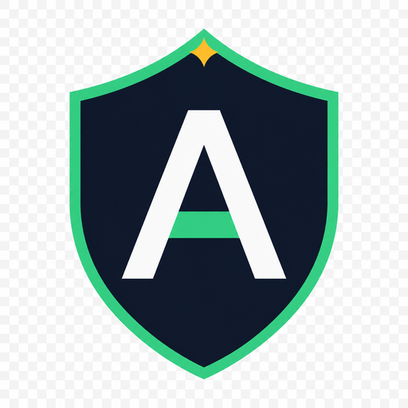

<p align="center">
  
</p>

# AdAegis

A small ad blocker for desktop Chrome and Chromium 120+. Network blocking is on by default. Page cleanup and YouTube filtering are optional and start off.

**0.4.1.1** is the current public release. It is loaded unpacked from GitHub, not listed on the Chrome Web Store.

[Install](#install) · [Changelog](CHANGELOG.md) · [Security](SECURITY.md) · [License](LICENSE)

## Install

Download **[adaegis-v0.4.1.1-chromium.zip](https://github.com/buntatoes/adaegis/releases/latest)** from [Releases](https://github.com/buntatoes/adaegis/releases). You do not need Node.js.

1. Extract the ZIP and keep the **AdAegis** folder somewhere permanent, such as Documents.
2. Open `chrome://extensions`.
3. Turn on **Developer mode** and click **Load unpacked**.
4. Select the **AdAegis** folder that contains `manifest.json`.

Pin it from the extensions menu and open the popup. A longer walkthrough ships in the ZIP as [INSTALL.html](INSTALL.html).

Chrome loads the extension from that folder. Leave it where it is. To update, copy the new files into the same folder, click **Reload**, and refresh open sites. To uninstall, click **Remove** on the Extensions page, then delete the folder.

## Features

- Bundled network rules for common ad-tech domains, on by default
- Pause until you turn it back on, or for 10 minutes or 1 hour
- Up to 200 exact-hostname exceptions, listed and editable in the popup
- Optional page cleanup that hides recognized ad containers
- Optional experimental YouTube and YouTube Music player filtering
- Settings stay on your computer: no account, no telemetry, no remote filter list, no auto-update

Basic blocking does not need access to the pages you visit. Page cleanup asks for HTTP/HTTPS access. YouTube filtering asks only for YouTube. Music filtering asks only for YouTube Music.

## YouTube filtering

Off by default. If you enable it, Chrome will ask for YouTube access. On home, watch, and Shorts it tries to:

- Strip known ad fields from an eligible player response, including later ad-heartbeat data and ad-only follow-up payloads
- Click a visible Skip button during an ad, including YouTube’s default button type
- If Skip is missing, jump to the end of the ad on the existing video element

Clicks from home, search, or a channel to a video stay in that same page. Player filtering stays ready on those YouTube pages so the next video is not missed. Skip clicks still only happen on home, watch, and Shorts. Account and billing URLs are left alone.

A stall or error on one video no longer turns the experiment off for the next video in that same page. A video that was already playing when you turned the experiment on may still need a reload. It will not catch every ad, and it can break playback. If that happens, turn it off and reload.

YouTube Music is a separate switch. It asks only for `music.youtube.com` and uses the same conservative edits.

## Build from source

A git clone is the development tree, not a Load unpacked folder. You need Node.js 22.18 or newer. The extension itself has no runtime npm packages.

```bash
npm install
npm run build      # compile TypeScript into dist/; then you can Load unpacked from this folder
npm run package    # test and write the ZIP under release/
```

```bash
npm run typecheck
```

Edit files under `src/`. `dist/` is generated by the build and is not in git. Do not edit it by hand.

| Path | What it is |
| --- | --- |
| `src/` | TypeScript sources |
| `dist/` | Generated locally by `npm run build`; also in the release ZIP |
| `rules/core.json` | Bundled network rules |
| `icons/` | Logo and toolbar icons |
| `tests/` | Automated checks |
| `docs/TESTING.md` | Manual browser checklist |

## License

Copyright 2026 Buntos ([buntatoes](https://github.com/buntatoes)).

AdAegis is licensed under the [Apache License 2.0](LICENSE). See [NOTICE](NOTICE) for attribution. No uBlock source, assets, or filter lists are included.
